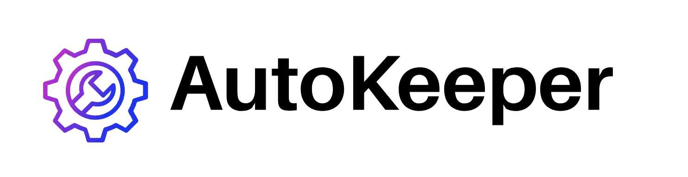

# AutoKeeper - Full Stack Web Application
AutoKeeper is a comprehensive vehicle maintenance web app that allows users to efficiently log and track their vehicles' maintenance records, including service mileage, services performed, and other vehicle information pertinent to the overall good health of your vehicle.

**View Project Live:** [autokeeper.cyclic.app](http://autokeeper.cyclic.app)

## How It's Made: ##

**Tech Used:** Node.js, Express.js, EJS, MongoDB, BootStrap, Passport.js

AutoKeeper was built using the Node.js engine on the Express.js framework. This app follows MVC structure, consisting of user and maintenance models, controller methods, and views. Views are rendered rendered live in templated HTML using EJS. This app communicates with a MongoDB database to create, store, and read various entries for vehicle information and maintenance. User authentication is routed through Passport.js for local authentication and hashing.

<!-- ## Optimizations

You don't have to include this section but interviewers *love* that you can not only deliver a final product that looks great but also functions efficiently. Did you write something then refactor it later and the result was 5x faster than the original implementation? Did you cache your assets? Things that you write in this section are **GREAT** to bring up in interviews and you can use this section as reference when studying for technical interviews! -->

## Project Outcomes:

AutoKeeper presented some fulfilling challenges across a number of full stack components, primarily:

- User authentication, database referencing, and hashing.
- MVC structuring and handling for various page interactions or events.
- Passing database objects correctly and situationally rendering in each unique view.
- Implementation of Bootstrap CSS framework for consistent, scalable, and attractive layout.

Despite any challenges presented in constructing this app, I enjoyed the process of procedurally building out each component, growing the capability of the app gradually. Additionally, I look to expand the app's capability and efficiecy through conversion to a React.js framework in the near future.

<!-- 
No matter what your experience level, being an engineer means continuously learning. Every time you build something you always have those *whoa this is awesome* or *wow I actually did it!* moments. This is where you should share those moments! Recruiters and interviewers love to see that you're self-aware and passionate about growing. -->

## Run AutoKeeper Locally: ##
1. Clone this repo to your local desktop
2. NPM install
3. Add '.env' file with MongoDB connection string (or other database).
4. npm run dev

## Examples: ##
If you enjoy AutoKeeper, I would be thrilled to have you check out some of my other work. Here are a few examples:

<!-- **myCocktail.io:** https://github.com/alecortega/palettable -->

<!-- **catBook:** https://github.com/alecortega/twitter-battle -->

